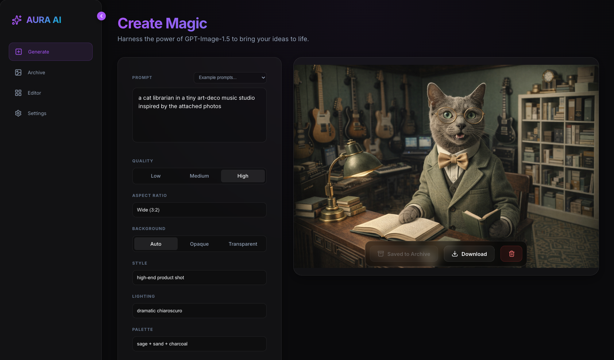
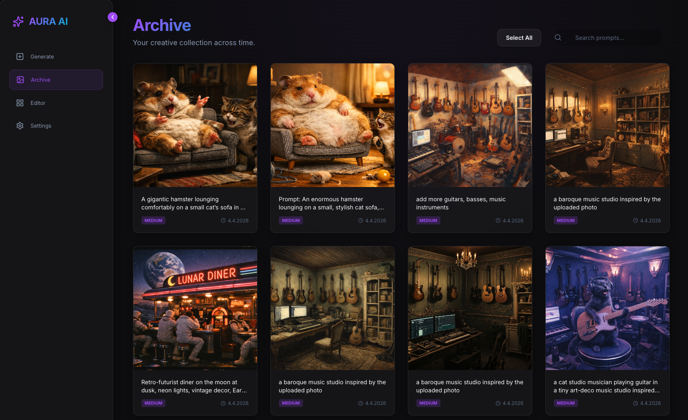
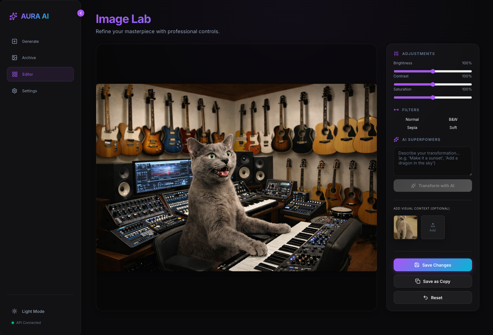

# AURA AI

AURA AI is a local-first browser studio for generating, organizing, editing, and iterating on AI images with the OpenAI Images API.

The app runs entirely in the browser. API keys, generated images, reference images, working session state, archive metadata, and lineage history stay on the local device instead of passing through an application backend.

## Screens

### Generate



### Archive



### Editor



## Highlights

- Prompt-based image generation with `gpt-image-1.5`
- `Single Shot` and `Autopilot` generation modes
- Goal-to-prompt translation, iterative scoring, and prompt refinement powered by `gpt-5.4`
- Prompt enhancement controls for style, lighting, palette, quality, aspect ratio, and background
- Reference-image workflows for guided generation and AI-assisted edits
- Creative lineage tracking across generation, create-similar, editor saves, AI edits, save-as-copy branches, and Autopilot iterations
- Local archive with search, multi-select actions, ZIP export, lineage-aware detail view, replay actions, fork actions, and keyboard navigation
- In-browser editor with brightness, contrast, saturation, filters, AI transforms, overwrite, save-as-copy, and reset controls
- Persistent local UI state for theme, prompts, generation settings, Autopilot settings, archive search, and editor controls
- Local-first persistence powered by SQLocal and IndexedDB

## Tech Stack

- React 19
- TypeScript
- Vite 7
- SQLocal for browser-local SQLite metadata
- `idb-keyval` for binary and transient IndexedDB storage
- JSZip for archive export bundles
- Vitest for module and workflow tests

## Runtime Requirements

- Node.js `20.19+` or `22.12+`
- npm `10+`

## Getting Started

```bash
npm install
npm run dev
```

Open the app in your browser, go to **Settings**, and enter an OpenAI API key to enable generation and editing.

## Available Scripts

```bash
npm run dev
npm run test
npm run typecheck
npm run build
npm run lint
npm run audit
npm run audit:fix
npm run preview
```

### Script Reference

- `npm run dev`
  Starts the Vite development server.

- `npm run dev -- --port 5175`
  Starts the Vite development server on a custom port.

- `npm run test`
  Runs the Vitest suite in non-watch mode.

- `npm run typecheck`
  Runs the TypeScript project build in type-check mode.

- `npm run build`
  Type-checks the app and creates a production build.

- `npm run lint`
  Runs ESLint across the repository.

- `npm run audit`
  Runs `npm audit` against the current lockfile.

- `npm run audit:fix`
  Applies lockfile-only audit remediations for transitive vulnerabilities.

- `npm run preview`
  Serves the production build locally with Vite preview.

- `npm run preview -- --port 4174`
  Serves the production build on a custom preview port.

## Application Overview

### Generate

The Generate view supports:

- Mode toggle between `Single Shot` and `Autopilot`
- Free-form text prompts plus example prompt presets
- Goal-to-prompt translation for Autopilot mode
- Quality options: `low`, `medium`, `high`
- Aspect ratio options: `auto`, `1024x1024`, `1536x1024`, `1024x1536`
- Background options: `auto`, `opaque`, `transparent`
- Style, lighting, and palette modifiers that are merged into the request prompt
- Configurable Autopilot iteration count from `1` to `8`
- Configurable Autopilot satisfaction threshold from `50` to `100`
- Cost disclosure and confirmation before each Autopilot run
- Live Autopilot progress, best-iteration highlighting, and pause/cancel support
- Multiple reference image uploads through file picker and drag-and-drop
- Reference preview modal with next and previous navigation
- Save-to-archive, download, and clear-result actions

Prompt-only generations use the OpenAI generations endpoint. When reference images are attached, the app switches to the edits endpoint so the request can include uploaded image inputs.

Autopilot reuses the current generation settings for every iteration, evaluates results against the goal, refines the prompt between iterations, and keeps the best-scoring result as the primary output.

### Archive

The Archive view supports:

- Prompt-based search with persisted search text
- Multi-select image management
- Select-all and deselect-all actions scoped to the current filtered result set
- ZIP export for selected images together with archive and lineage manifests
- Bulk deletion with confirmation
- Image detail modal with prompt copy, metadata display, reference previews, lineage timeline, and step selection
- Lineage replay into Generate for generation, reference-generation, and Autopilot steps
- Lineage replay into Editor for replayable edit branches
- Fork-from-step actions for branching future saves from any recorded lineage step
- Autopilot lineage metadata including goal, iteration number, score, and evaluator feedback
- Previous and next navigation from the detail modal with keyboard arrow support
- Create Similar to transfer prompt settings and references back into Generate

The lineage detail view can display the currently selected archive image, an ancestor step, or a stored Autopilot iteration preview from the lineage metadata.

### Editor

The Editor view supports:

- Brightness, contrast, and saturation controls
- Quick filters: `Normal`, `B&W`, `Sepia`, and `Soft`
- AI transformation prompts applied to the current canvas image
- Optional reference images for edit guidance
- Save changes in place
- Save as copy
- Reset controls back to defaults

Editor adjustments persist locally per image, and editor saves are recorded in lineage as overwrite, save-as-copy, or AI-edit steps depending on the action taken.

### Settings

The Settings view supports:

- Local OpenAI API key storage in the browser
- Saved-key status feedback and masked key entry
- Immediate generation and editing availability once a key is stored

The sidebar also includes a persistent theme toggle and a collapsible navigation rail.

## Storage Model

The application is designed as a local-first web app.

- OpenAI API keys are stored in browser `localStorage`
- View state, generation settings, Autopilot settings, archive search, and editor adjustments are stored in browser `localStorage`
- Current generated results and transferred reference payloads are stored in IndexedDB via `idb-keyval`
- Archive image metadata is stored in a browser-local SQLite database via SQLocal
- Lineage metadata is stored in a browser-local SQLite database via SQLocal
- Archive ZIP bundles contain `archive-manifest.json` and `lineage-manifest.json`

There is no custom backend service in this repository.

## OpenAI Integration

The app calls the OpenAI API directly from the browser.

- Prompt-only generations use `POST /v1/images/generations`
- Reference-based generations and editor transforms use `POST /v1/images/edits`
- Autopilot goal translation, evaluation, and prompt refinement use `POST /v1/responses`
- The image generation model is `gpt-image-1.5`
- Autopilot reasoning uses `gpt-5.4`
- The app requests a single image per generation or edit operation
- Image responses are consumed as base64 payloads and converted into browser-safe data URLs for preview and persistence

Additional implementation details live in:

- `docs/openAI_image_generation.md`
- `docs/openAI_create_image.md`

## Privacy and Security

- The project is designed for local use in the browser
- Secrets are not committed to the repository
- The repository does not ship with embedded API keys, `.env` files, or private key material
- Sensitive OpenAI request payloads are not logged by the client helper

If you fork this project, keep the same standard for your own commits and issues.

## Project Structure

```text
src/
  app/             App-level controller, notifications, and persisted preferences
  archive/         Archive storage, ZIP export/import helpers, and archive controllers
  autopilot/       Autopilot orchestration and GPT-5.4 helper modules
  components/      Reusable UI components and modals
  db/              SQLocal bootstrap and persistence types
  editor/          Canvas editing, editor sessions, and save flows
  generate-session Generate draft persistence, save logic, and Autopilot glue
  image-workflow/  OpenAI request orchestration for generate and edit flows
  lineage/         Lineage storage, replay, timelines, and metadata helpers
  references/      Reference image collection state and hydration helpers
  services/        IndexedDB-backed storage adapters
  utils/           OpenAI and file conversion helpers
  views/           Generate, Archive, Editor, and Settings views
docs/
  agentic-creative-autopilot-prd.md
  creative-lineage-autopilot-qa-plan.md
  creative-lineage-graph-prd.md
  openAI_create_image.md
  openAI_image_generation.md
  prompt.md
plans/
  creative-lineage-and-autopilot.md
```

## Documentation

- `docs/openAI_image_generation.md` describes the current OpenAI integration and request routing
- `docs/openAI_create_image.md` maps Generate, Editor, and Autopilot flows to the request payloads used by the app
- `docs/creative-lineage-graph-prd.md` captures the lineage product requirements
- `docs/agentic-creative-autopilot-prd.md` captures the Autopilot product requirements
- `docs/creative-lineage-autopilot-qa-plan.md` outlines QA coverage for lineage and Autopilot flows
- `plans/creative-lineage-and-autopilot.md` summarizes the implementation plan behind the current lineage and Autopilot architecture

## License

This project is released under the MIT License. See `LICENSE` for details.
