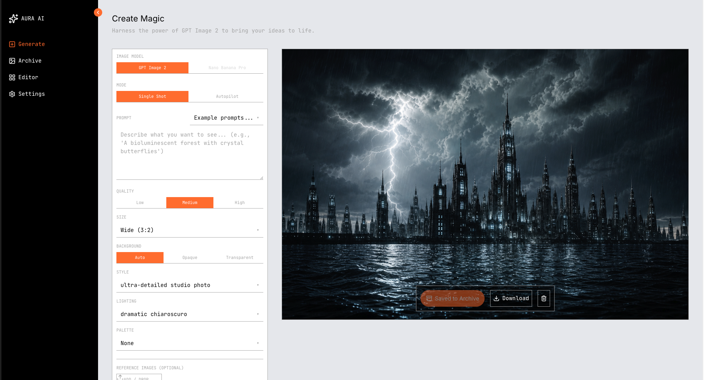
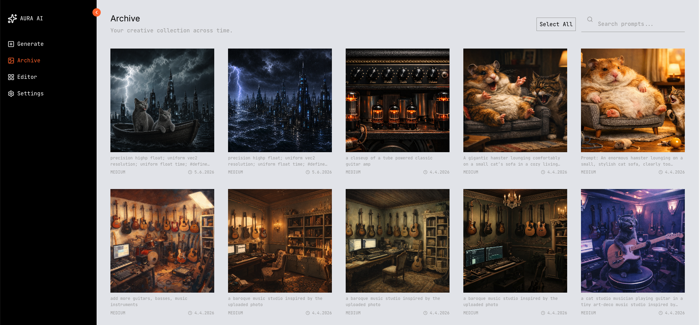
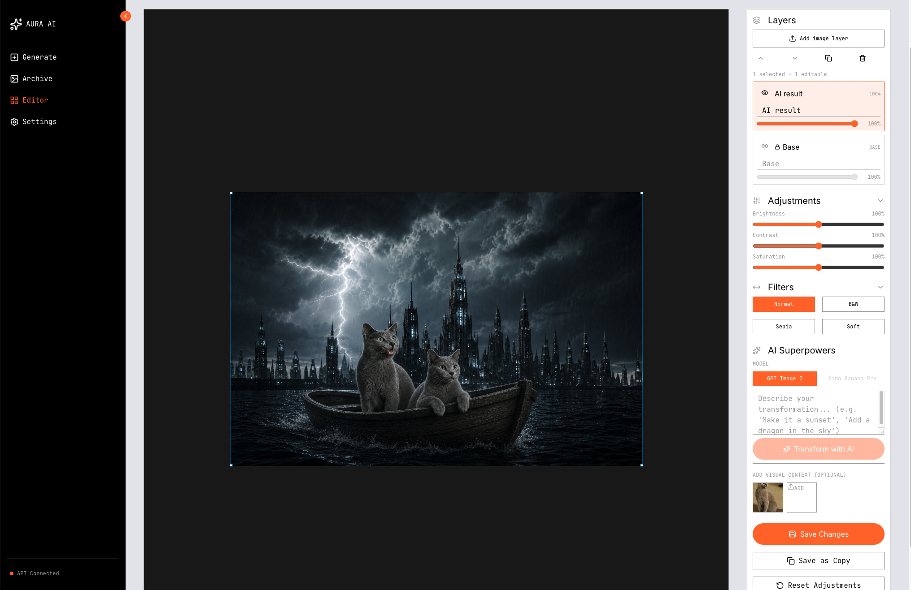
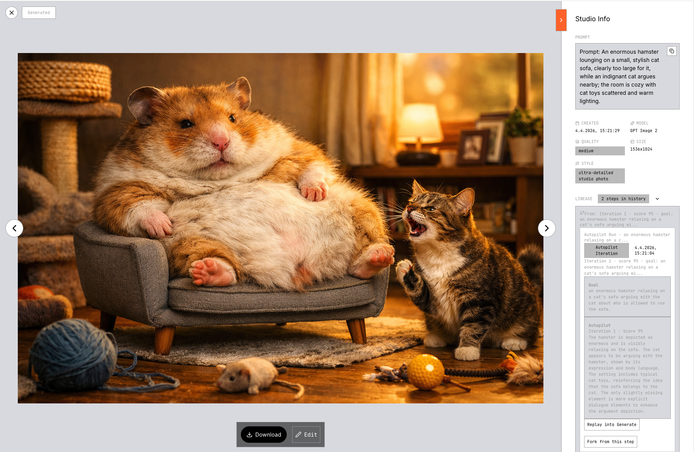

# AURA AI

AURA AI is a local-first browser studio for generating, organizing, editing, and iterating on AI images with OpenAI and Google-hosted image models.

The app runs entirely in the browser. Provider API keys, generated images, reference images, layer assets, working session state, archive metadata, and lineage history stay on the local device instead of passing through an application backend.

The interface follows the Telepathic Instruments-inspired visual system documented in `docs/DESIGN.md`: stark panels, monochrome surfaces, amber action emphasis, compact controls, and typography tuned for a focused creative tool rather than a marketing page.

## Screens

| Generate | Archive |
|----------|---------|
|  |  |

| Editor | Detail |
|--------|--------|
|  |  |

## Highlights

- Prompt-based image generation with `gpt-image-2` and `nano-banana-pro`
- `Single Shot` and `Autopilot` generation modes
- Batch generation of up to four images per run with a per-slot result grid, save-all, and per-result reuse actions
- Streaming partial-image previews during single-shot generation for models that support it
- Reuse any generated result as a reference image with a single action
- Actual generation parameter reporting for revised prompts, size, quality, and elapsed time
- Goal-to-prompt translation, iterative scoring, and prompt refinement with selectable reasoning models: `gpt-5.4` and `gemini-2.5-flash`
- Provider-specific API key storage for OpenAI and Google
- Prompt enhancement controls for style, lighting, palette, and model-specific output settings
- Shared image-model facts for Generate and Editor controls, provider routing, capabilities, reference limits, and archive metadata
- Reference-image workflows for guided generation and AI-assisted edits, including clipboard paste
- Transform-mask painting for targeted AI edits, persisted in lineage and replayable into the editor
- Creative lineage tracking across generation, create-similar, editor saves, AI edits, save-as-copy branches, and Autopilot iterations
- Local archive with search, favorites filtering, multi-select actions, layer-aware ZIP export/import, manifest recovery, lineage-aware detail view, replay actions, fork actions, and keyboard navigation
- Layered in-browser editor with image layers, blend modes, layer locking, drag reordering, keyboard nudging, live composition adjustments, AI result layers, non-destructive drafts, undo/redo, overwrite, save-as-copy, reset, and revert controls
- Background completion notifications for finished generation runs
- Persistent local UI state for prompts, model-specific generation settings, Autopilot settings, archive search and favorites filter, editor drafts, editor controls, and notification preferences
- Local-first persistence powered by SQLocal and IndexedDB

## Tech Stack

- React 19
- TypeScript
- Vite 7
- SQLocal for browser-local SQLite metadata
- `idb-keyval` for binary and transient IndexedDB storage
- JSZip for archive export bundles
- Konva and React Konva for the layered editor canvas
- Lucide React for iconography
- Vitest for module and workflow tests

## Runtime Requirements

- Node.js `20.19+` or `22.12+`
- npm `10+`

## Getting Started

```bash
npm install
npm run dev
```

Open the app in your browser, go to **Settings**, and enter the provider keys for the models you want to use. OpenAI powers `gpt-image-2` and `gpt-5.4`; Google powers `nano-banana-pro` and `gemini-2.5-flash`.

## Available Scripts

```bash
npm run dev
npm run test
npm run typecheck
npm run build
npm run lint
npm run audit
npm run audit:fix
npm run preview
```

### Script Reference

- `npm run dev`
  Starts the Vite development server.

- `npm run dev -- --port 5175`
  Starts the Vite development server on a custom port.

- `npm run test`
  Runs the Vitest suite in non-watch mode.

- `npm run typecheck`
  Runs the TypeScript project build in type-check mode.

- `npm run build`
  Type-checks the app and creates a production build.

- `npm run lint`
  Runs ESLint across the repository.

- `npm run audit`
  Runs `npm audit` against the current lockfile.

- `npm run audit:fix`
  Applies lockfile-only audit remediations for transitive vulnerabilities.

- `npm run preview`
  Serves the production build locally with Vite preview.

- `npm run preview -- --port 4174`
  Serves the production build on a custom preview port.

## Application Overview

### Generate

The Generate view supports:

- Image model selection between `GPT Image 2` and `Nano Banana Pro`
- Mode toggle between `Single Shot` and `Autopilot`
- Free-form text prompts plus example prompt presets
- Goal-to-prompt translation for Autopilot mode
- Reasoning model selection between `GPT 5.4` and `Gemini 2.5 Flash` in Autopilot mode
- `GPT Image 2` quality options: `low`, `medium`, `high`
- `GPT Image 2` size options: `auto`, `1024x1024`, `1536x1024`, `1024x1536`
- `GPT Image 2` background options: `auto`, `opaque`, `transparent`
- `Nano Banana Pro` aspect ratio options: `1:1`, `2:3`, `3:2`, `3:4`, `4:3`, `4:5`, `5:4`, `9:16`, `16:9`, `21:9`
- `Nano Banana Pro` resolution options: `1K`, `2K`, `4K`
- `GPT Image 2` batch size options: `1`, `2`, `3`, `4`
- `Nano Banana Pro` batch size options: `1`, `2`, `3`, `4`
- Style, lighting, and palette modifiers that are merged into the request prompt
- Configurable Autopilot iteration count from `1` to `8`
- Configurable Autopilot satisfaction threshold from `50` to `100`
- Cost disclosure and confirmation before each Autopilot run, including the selected image and reasoning models
- Live Autopilot progress, best-iteration highlighting, and pause/cancel support
- Multiple reference image uploads through file picker, drag-and-drop, and clipboard paste
- `Nano Banana Pro` reference inputs are capped to the first `14` images for provider compatibility
- Reference preview modal with next and previous navigation
- Streaming partial-image previews during single-shot generation for models that support partial streaming
- A batch result grid for multi-image runs with per-slot save, download, use-as-reference, and isolated per-slot failure reporting
- Save All and Clear Results actions for batch runs
- Use as Reference to feed a generated result back into the reference set while preserving lineage
- Actual parameter panels that surface the revised prompt, size, quality, and elapsed time returned with each result
- Save-to-archive, download, and clear-result actions

Prompt-only `GPT Image 2` generations use the OpenAI generations endpoint. `GPT Image 2` requests with reference images use the OpenAI edits endpoint so the request can include uploaded image inputs. `Nano Banana Pro` generation and reference-guided generation use Google Gemini `generateContent` requests with text and inline image parts.

Batch runs request multiple images per generation. `Nano Banana Pro` fans batch requests out into parallel `generateContent` calls so a failed slot stays isolated while the rest of the batch succeeds.

Saved Generate results use the provider-run reference image snapshot, so archive metadata and lineage reflect the exact images sent to the model even if the visible reference collection changes later.

Autopilot reuses the current image model settings and provider-used reference snapshot for every iteration, evaluates results against the goal with the selected reasoning model, refines the prompt between iterations, and keeps the best-scoring result as the primary output. Autopilot result slots carry lineage and actual parameter metadata like regular generated results.

### Archive

The Archive view supports:

- Prompt-based search with persisted search text
- Favorites toggle on each image card with a persisted favorites-only filter
- Multi-select image management
- Select-all and deselect-all actions scoped to the current filtered result set
- ZIP export for selected images together with archive manifests, lineage manifests, reference images, flattened images, and layer assets
- Bulk deletion with confirmation
- Image detail modal with prompt copy, metadata display, reference previews, lineage timeline, and step selection
- Model-aware detail metadata for saved image model settings and actual generation parameters
- Lineage replay into Generate for generation, reference-generation, and Autopilot steps
- Lineage replay into Editor for replayable edit branches
- Fork-from-step actions for branching future saves from any recorded lineage step
- Autopilot lineage metadata including goal, iteration number, score, and evaluator feedback
- Previous and next navigation from the detail modal with keyboard arrow support
- Create Similar to transfer prompt, image model, model-specific controls, style controls, and references back into Generate

The lineage detail view can display the currently selected archive image, an ancestor step, or a stored Autopilot iteration preview from the lineage metadata. Archive transfer helpers validate ZIP imports and report missing assets or broken parent references, while the app also supports manifest-based metadata recovery through URL parameters.

Layered archive imports tolerate older and partial archive bundles by recovering the flattened image, available layer assets, manifest metadata, lineage steps, actual parameters, favorites, and reference assets that are present.

### Editor

The Editor view supports:

- A Konva-backed layered canvas with a locked base layer for the opened archive image
- Uploaded raster image layers that become part of the visible composition
- Layer selection, multi-selection, rename, visibility, opacity, lock, blend mode, reorder, move up/down, duplicate, and delete actions
- Layer blend modes: `normal`, `multiply`, `screen`, `overlay`, `darken`, `lighten`, `soft-light`, and `difference`
- Drag reordering of non-base layers and locking to protect a layer from transform edits
- Direct move, scale, and rotation handles for the primary selected non-base layer
- Keyboard nudging of selected layers by `1` pixel, or `10` pixels with `Shift`
- Brightness, contrast, and saturation controls applied live to the full composition
- Quick filters: `Normal`, `B&W`, `Sepia`, and `Soft`, applied live to the canvas
- Collapsible Adjustments and Filters sections
- AI transformation prompts with selectable image models
- AI transform model selection that can inherit the source image model while still allowing an explicit override
- AI transforms targeted to selected visible non-base layers, or to the whole visible composition when no editable layer is selected
- AI transform requests separate the editable source image, composition context, and optional user reference images before provider mapping
- Transform-mask painting with brush and eraser tools and an adjustable brush size for models that support masked edits
- AI result layers inserted non-destructively above the targeted layer selection
- Optional visual context reference images for edit guidance through file picker, drag-and-drop, or clipboard paste
- Unsaved editor drafts persisted per archive image
- Undo and redo for layer, adjustment, reference, and AI result changes
- Save changes in place
- Save as copy
- Reset Adjustments and Revert Draft controls

Editor saves are recorded in lineage as overwrite, save-as-copy, manual-edit, or AI-edit steps depending on the action taken. Transform masks used for AI edits are stored with the lineage step and replayed back into the editor when an edit branch is reopened. Layered images keep durable layer stack metadata and per-layer image assets alongside the flattened archive preview.

Editor lineage metadata records the target plan, source image, composition context, reference images, output layer, transform mask, layer stack summary, and save mode needed to summarize or replay an edit branch.

### Settings

The Settings view supports:

- Local OpenAI API key storage in the browser
- Local Google Gemini API key storage in the browser
- Saved-key status feedback and masked key entry
- Immediate model availability once the matching provider key is stored
- A completion notifications toggle that surfaces a desktop notification when a run finishes while the app is in the background
- Notification readiness status that reflects unsupported browsers and insecure contexts

The sidebar includes a collapsible navigation rail.

## Storage Model

The application is designed as a local-first web app.

- Provider API keys are stored in browser `localStorage`
- View state, generation drafts, model-specific generation settings, Autopilot settings, archive search, archive favorites filter, completion notification preference, and editor drafts are stored in browser `localStorage`
- Current generated batch results and transferred reference payloads are stored in IndexedDB via `idb-keyval`
- Archive image metadata is stored in a browser-local SQLite database via SQLocal
- Layer stack metadata is stored with archive image metadata in SQLocal
- Flattened images, reference images, and per-layer image assets are stored in IndexedDB via `idb-keyval`
- Lineage metadata, including typed Generate, Editor, Autopilot, transform-mask, and actual-parameter metadata, is stored in a browser-local SQLite database via SQLocal
- Favorite flags are stored with archive image metadata in SQLocal
- Archive ZIP bundles contain image files, reference files, layer asset files, `archive-manifest.json`, and `lineage-manifest.json`
- Archive import, export, delete, copy, and metadata recovery flows share the same archive manifest and asset ownership language

There is no custom backend service in this repository.

## Provider Integration

The app calls provider APIs directly from the browser.

- OpenAI image generation uses `POST /v1/images/generations`
- OpenAI reference-based generation and editor transforms use `POST /v1/images/edits`
- OpenAI Autopilot reasoning uses `POST /v1/responses`
- Google image generation and editing use Gemini `generateContent`
- Google Autopilot reasoning uses Gemini `generateContent`
- Image models: `gpt-image-2`, `nano-banana-pro`
- Reasoning models: `gpt-5.4`, `gemini-2.5-flash`
- Shared image-model control facts drive UI choices, default values, validation, provider request mapping, reference limits, mask capability, streaming capability, and archive metadata
- The app requests between one and four images per generation, fanning `Nano Banana Pro` batches out into isolated parallel requests
- Single-image OpenAI generations can stream partial-image previews when the model supports it
- Editor AI transforms can include a painted mask for models that support masked edits
- Image responses are consumed as base64 payloads and converted into browser-safe data URLs for preview and persistence
- Provider responses report actual generation parameters such as the revised prompt, size, quality, and elapsed time

Additional implementation details live in:

- `docs/openAI_image_generation.md`
- `docs/openAI_create_image.md`

## Privacy and Security

- The project is designed for local use in the browser
- Secrets are not committed to the repository
- The repository does not ship with embedded API keys, `.env` files, or private key material
- Sensitive provider request payloads are not logged by the client helpers

If you fork this project, keep the same standard for your own commits and issues.

## Project Structure

```text
src/
  app/             App-level controller, notifications, and persisted preferences
  archive/         Archive storage, ZIP export/import helpers, and archive controllers
  autopilot/       Autopilot orchestration and reasoning-model helper modules
  components/      Reusable UI components and modals
  db/              SQLocal bootstrap and persistence types
  download/        Local download helpers for images and ZIP bundles
  editor/          Canvas editing, editor sessions, and save flows
  generate-session Generate draft persistence, save logic, and Autopilot glue
  hooks/           Shared React hooks for local storage and archive state
  image-models/    Image-model control facts, validation, limits, and provider request mapping
  image-workflow/  Provider request orchestration for generate and edit flows
  lineage/         Lineage storage, replay, timelines, and metadata helpers
  references/      Reference image collection state and hydration helpers
  services/        IndexedDB-backed storage adapters
  utils/           Provider model constants, OpenAI helpers, and file conversion helpers
  views/           Generate, Archive, Editor, and Settings views
docs/
  agentic-creative-autopilot-prd.md
  creative-lineage-autopilot-qa-plan.md
  creative-lineage-graph-prd.md
  DESIGN.md
  adr/
  openAI_create_image.md
  openAI_image_generation.md
plans/
  creative-lineage-and-autopilot.md
  layered-editor.md
  localstorage-to-sqlite.md
  telepathic-instruments-rebrand.md
```

## Documentation

- `CONTEXT.md` defines the repo's domain vocabulary for image models, providers, lineage, and layered editor concepts
- `docs/DESIGN.md` defines the Telepathic Instruments-inspired visual design language used by the app
- `docs/openAI_image_generation.md` describes the current provider integration and request routing
- `docs/openAI_create_image.md` maps Generate, Editor, and Autopilot flows to the request payloads used by the app
- `docs/adr/` captures durable architecture decisions for archive assets, Konva canvas rendering, editor history, copy semantics, AI transform targeting, and layered-image adjustments
- `docs/creative-lineage-graph-prd.md` captures the lineage product requirements
- `docs/agentic-creative-autopilot-prd.md` captures the Autopilot product requirements
- `docs/creative-lineage-autopilot-qa-plan.md` outlines QA coverage for lineage and Autopilot flows
- `plans/creative-lineage-and-autopilot.md` summarizes the implementation plan behind the current lineage and Autopilot architecture
- `plans/layered-editor.md` summarizes the implementation plan behind the current layered editor architecture

## License

This project is released under the MIT License. See `LICENSE` for details.
